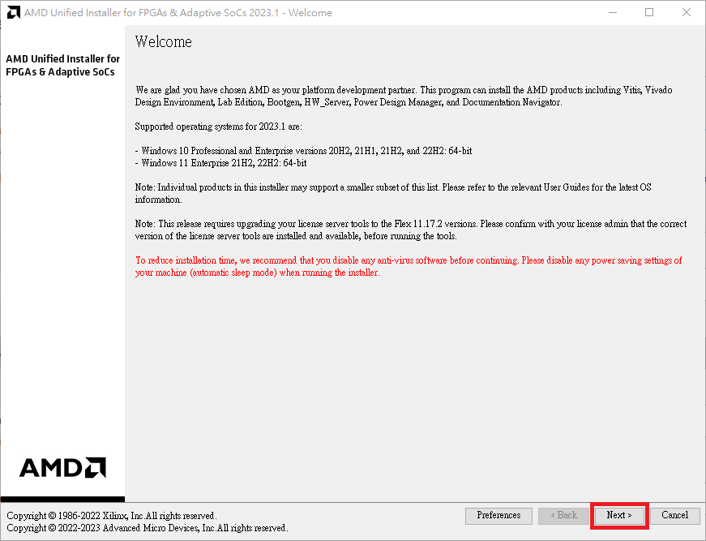
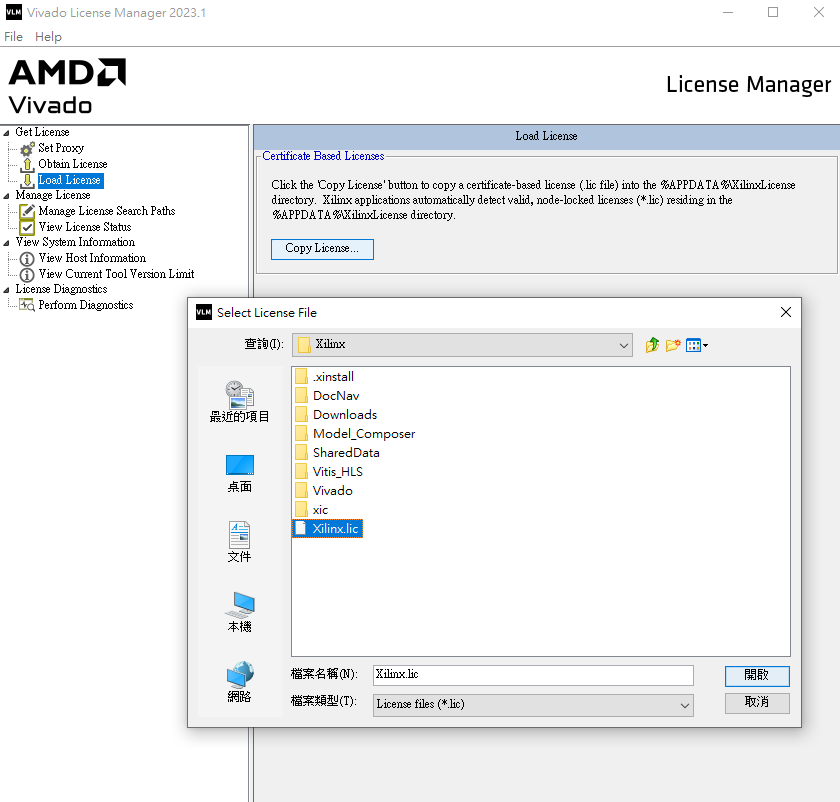

# Table of Contents
- <a href="#Vivado安裝檔下載" style="text-decoration: none; color: #333;">Vivado安裝檔下載</a>
- <a href="#安裝流程" style="text-decoration: none; color: #333;">安裝流程</a>
- <a href="#vivado-license下載" style="text-decoration: none; color: #333;">vivado-license下載</a>

# Vivado安裝檔下載
先到官網下載Vivado安裝檔[Downloads (xilinx.com)](https://www.xilinx.com/support/download.html)，按照作業系統選擇對應安裝檔，下載前需要註冊AMD帳號並填入基本資料。

# 安裝流程
此文選用2023.1版本作為示範，其他版本安裝流程大同小異，請安心服用!
1. 執行下載好的安裝檔，會彈出下面安裝視窗，點選 **Next>**

2. 輸入AMD帳號密碼並選擇 **Download and Install Now**，接著點選 **Next>**

3. 如果沒有軟體開發需求，則選擇 **Vivado**即可，有軟體開發需求請選擇 **Vitis**，接著點選 **Next>**

4. 選擇 **Vivado ML Enterprise**

5. 套件包按照個人需求選擇即可

6. 全部點選 **I Agree**，接著點選 **Next>**

7. 選擇安裝路徑，不建議安裝在預設的C槽

8. 確認安裝選項及所需磁碟空間，確認沒問題點選 **Install**

9. 接著就是漫長的等待時間~

10. 下載完必要檔案後會彈出安裝確認視窗，點擊**安裝**

11. 安裝過程中如果跳出Warning不要緊張，按**確定**即可

12. 當看到安裝結束的視窗，表示整個安裝過程完成

13. 在10~12步安裝過程中會同時安裝WinPcap軟體，依次安裝即可

14.  接著會彈出 **Vivado License Manager**，如果已經有License，點擊 **Get License -> Load License**。如果還沒有License，請先按照<a id="lic" href="#vivado-license下載" style="text-decoration: none;">vivado-license下載</a>流程獲取，再回來繼續認證

15.  點擊 **Copy License**，選擇已存在的 **.lic檔案**

16.  跳出以下視窗表示License檔案載入完成，可以開始使用Vivado了!

17.  接著可以在 **Manage License -> View License Status** 中查看註冊文件狀態，包含使用年限，適用版本等資訊

# Vivado License下載
1. 到[Licensing Solution Center (xilinx.com)](https://www.xilinx.com/support/licensing_solution_center.html)頁面的右側 **Quick Links** 點擊 **Access Product Licensing Site**

2. 接著需要登陸AMD帳號進行 **Product Licensing - Name and Address Verification**
3. 接著會進入Product Licensing的頁面，勾選 **Vivado ML Enterprise Edition License** 選項，點擊 **Create Node-Locked License**

4. 在創建註冊文件視窗中，需要建立一個 **HOST**

5. 填完相關資訊後點擊 **Add -> Next**

6. 再次點擊 **Next**，生成註冊檔

7. 完成註冊后，系統會將註冊文件發送至帳號郵箱中，同時在License管理頁面可以看到新生成的註冊檔

8. 到信箱收取系統寄出的信件並下載附件的License檔案，接著就可以<a href="#lic">回去繼續認證了</a>!

